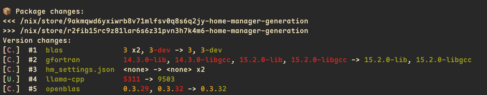

# nix-config

[](https://builtwithnix.org)

Home Manager configuration for macOS (aarch64-darwin) and Ubuntu/NixOS (x86_64-linux) machines.

## Quick Start

```bash
# First-time setup
just bootstrap

# Apply config (reads $HM_FLAKE_ATTR from .envrc.local)
just switch
```



## Structure

```
.
├── flake.nix              # Entry point: inputs, homeConfigurations, devShells
├── justfile               # Task runner: switch, check, fix, update, gc
├── home-manager/
│   ├── home.nix           # Main HM config
│   ├── modules/           # core/, programs/, shell/
│   └── config/            # Raw configs (.npmrc, iterm2.json, pi/)
├── secrets/               # agenix-encrypted secrets
├── docs/                  # Detailed docs per topic
└── bin/                   # bootstrap.sh, check-eval.sh
```

See [AGENTS.md](AGENTS.md) for the full architecture.

## Common Commands

| Command | Description |
|---|---|
| `just switch` | Apply Home Manager config |
| `just check` | Validate evaluation + run tests |
| `just fix` | Format (alejandra) + lint (deadnix, statix) |
| `just update` | Update `nixpkgs-unstable` flake input |
| `just gc` | Garbage collect profiles older than 2 days |

## Docs

| Doc | Topic |
|---|---|
| [AGENTS.md](AGENTS.md) | Full architecture, directory layout, conventions |
| [docs/macOS.md](docs/macOS.md) | macOS-specific setup |
| [docs/ubuntu.md](docs/ubuntu.md) | Ubuntu/NixOS setup |
| [docs/atuin.md](docs/atuin.md) | Atuin shell history (setup, sync, troubleshooting) |
| [docs/dev-env.md](docs/dev-env.md) | Development environment details |
| [docs/pi-deepseek.md](docs/pi-deepseek.md) | Pi coding agent with DeepSeek |
| [docs/edge.md](docs/edge.md) | Nixpkgs edge/unstable usage |
| [docs/bookmarks.md](docs/bookmarks.md) | Browser bookmarks |
| [docs/NixOS.md](docs/NixOS.md) | NixOS-specific notes |
