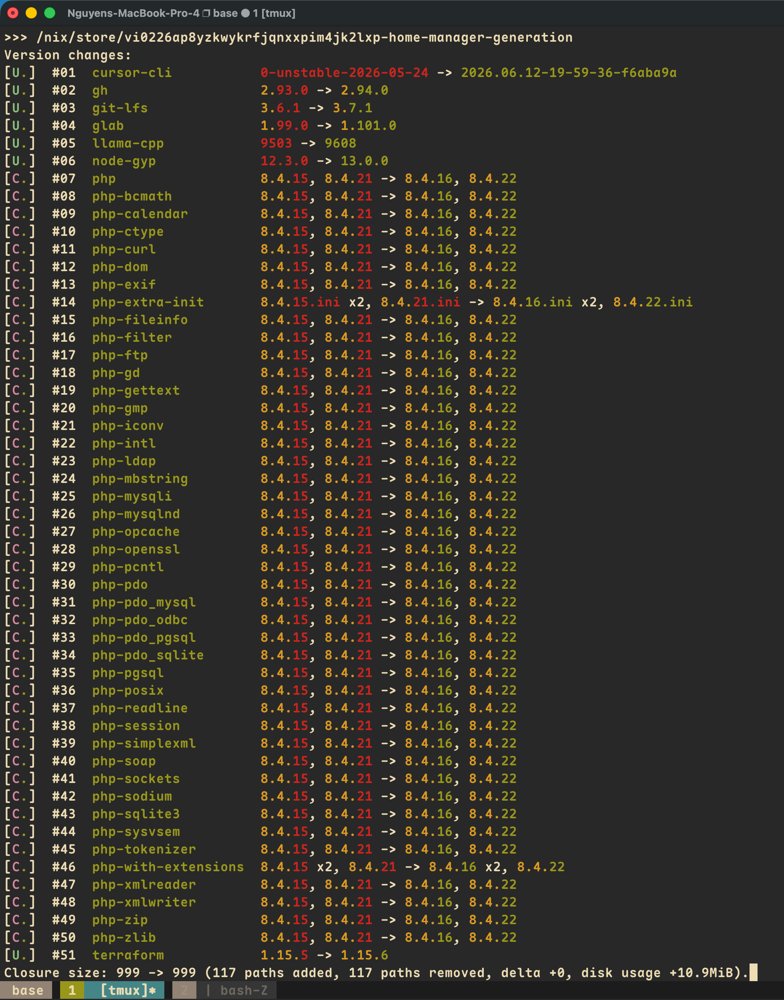

# nix-config

[](https://builtwithnix.org)

Home Manager configuration for macOS (aarch64-darwin) and Ubuntu/NixOS (x86_64-linux) machines.

## Quick Start

```bash
# First-time setup
just bootstrap

# Apply config (reads $HM_FLAKE_ATTR from .envrc.local)
just switch
```



## Structure

```
.
├── flake.nix              # Entry point: inputs, homeConfigurations, devShells
├── justfile               # Task runner: switch, check, fix, update, gc
├── apps/oh-my-token/      # Swift menu-bar app source
├── pkgs/                 # Custom Nix packages
├── home-manager/
│   ├── home.nix           # Main HM config
│   ├── modules/           # core/, programs/, shell/
│   └── config/            # Raw configs (.npmrc, iterm2.json, pi/)
├── secrets/               # agenix-encrypted secrets
├── docs/                  # Detailed docs per topic
└── bin/                   # bootstrap.sh, check-eval.sh
```

See [AGENTS.md](AGENTS.md) for the full architecture.

## Common Commands

| Command | Description |
|---|---|
| `just switch` | Apply Home Manager config |
| `just check` | Validate evaluation + run tests |
| `just fix` | Format (alejandra) + lint (deadnix, statix) |
| `just update` | Update `nixpkgs-unstable` flake input |
| `just gc` | Garbage collect profiles older than 2 days |

## oh-my-token

`oh-my-token` monitors website usage for Claude Personal, Claude Work, and ChatGPT Personal.
It requires macOS 14 or later.

The Swift package lives in `apps/oh-my-token/`.
The application icon lives in `apps/oh-my-token/AppIcon.icns`.
The Nix package lives in `pkgs/oh-my-token.nix`.
Nix supplies Swift and the macOS SDK.
The app has no external package dependencies and does not require Xcode.

### Build and install

```bash
nix build .#oh-my-token
open result/Applications/oh-my-token.app

just check
just switch
```

Home Manager installs the app on GUI-enabled macOS hosts.
Linux configurations do not include this package.
Quit and reopen the app after an update.

### Fast local development

`just app-run` builds the app with the SwiftPM cache and opens the local bundle.
A rebuild after a small change takes a few seconds.
The first build takes longer.

```bash
just app-run
```

The Nix derivation is split into two steps:

1. A Swift binary step.
2. A small app-bundle step.

A change to `Info.plist` or `AppIcon.icns` does not recompile the Swift code.
A Nix build is always a clean release build.
A Nix build does not use the SwiftPM cache.
Use `just app-run` for fast iteration and `just switch` for the final install.

### Connect accounts

1. Click the menu-bar gauge and select **Accounts…**.
2. Select **Sign in…** for each account.
3. Sign in on the website, then select **Check account**.
4. Select the intended Claude workspace in **Accounts…**.

Each account uses a separate persistent website profile.
Emails come from authenticated website responses.
Usage refreshes every five minutes.
In Low Power Mode or when the Mac is hot, usage refreshes every 15 minutes.
Reset countdowns update locally.
Failed requests retain the last reading with its original timestamp and a stale marker.
Authentication rejection clears the reading.

Google does not allow sign-in inside embedded browsers.
Use **Import session…** for Google sign-in or incompatible company SSO.
The import dialog explains how to copy a website Cookie request header.
Imported cookies grant account access.
Import only your own sessions and follow your work security policy.
The app stores imported cookies in your local macOS Keychain.
**Disconnect** removes that account slot's website data and imported Keychain entry.
Do not put cookies, tokens, or account data in this repository.
See [apps/oh-my-token/SECURITY.md](apps/oh-my-token/SECURITY.md) for the storage locations and the read-only rule.

### Usage limits

Claude shows reported session, weekly, and model-specific percentages and reset times.
Work plans without reported limits show an unavailable status.

ChatGPT shows the Work and Codex dashboard allowance.
The dashboard reports a 5-hour window and a weekly window.
Each window shows a used percentage and a reset time.
An account with additional allowances shows one row for each allowance.
The app does not estimate an overall chat percentage or a remaining message count.
Ambiguous ChatGPT workspace contexts do not produce a personal quota reading.

### Read-only guarantee

The app never sends a prompt and never uses account tokens.
This rule applies to every provider: Claude and ChatGPT.
Every request is a read-only GET request to a usage endpoint.
The shared request helper accepts no request body and sends no POST request.
The app sends no message and starts no conversation.
The app polls usage while it runs, at the interval in **Connect accounts**.
Reading the usage dashboard does not consume account quota.

Each read first loads the provider `/robots.txt` file in a hidden page.
The readers run on this page, not in the full website.
The Claude reader requests `/api/account`, `/api/organizations`, and the organization usage endpoint.
The ChatGPT reader requests the session, account check, and dashboard usage endpoints.
All of these requests are read-only.

The readers use private website endpoints.
Provider changes, Cloudflare challenges, or expired sessions can prevent updates.

Schema references:
[Claude website usage](https://github.com/steipete/CodexBar/blob/a379b25de76a26a1d7e01062094f9ca1312f0730/Sources/CodexBarCore/Providers/Claude/ClaudeWeb/ClaudeWebAPIFetcher.swift)
and [ChatGPT website usage](https://github.com/robotlearning123/gpt2agent/blob/20669693dd608a94a5b5aba54c4c4a036f064375/gpt2agent/usage.py).

## Docs

| Doc | Topic |
|---|---|
| [AGENTS.md](AGENTS.md) | Full architecture, directory layout, conventions |
| [docs/macOS.md](docs/macOS.md) | macOS-specific setup |
| [docs/ubuntu.md](docs/ubuntu.md) | Ubuntu/NixOS setup |
| [docs/atuin.md](docs/atuin.md) | Atuin shell history (setup, sync, troubleshooting) |
| [docs/dev-env.md](docs/dev-env.md) | Development environment details |
| [docs/pi-deepseek.md](docs/pi-deepseek.md) | Pi coding agent with DeepSeek |
| [docs/edge.md](docs/edge.md) | Nixpkgs edge/unstable usage |
| [docs/bookmarks.md](docs/bookmarks.md) | Browser bookmarks |
| [docs/NixOS.md](docs/NixOS.md) | NixOS-specific notes |
| [docs/coding-agents.md](docs/coding-agents.md) | Personal experience with coding agents (Claude Code, Pi, OpenCode, etc.) |
