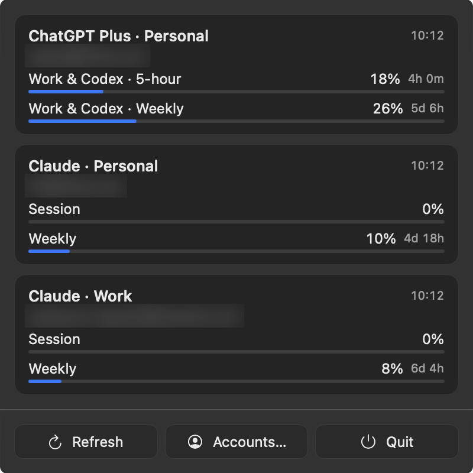

# oh-my-token

A read-only macOS menu bar app that shows Claude and ChatGPT usage across multiple accounts.

## Screenshot

## Purpose

Track usage limits and reset times in one place, without opening each provider website.
Keep usage monitoring separate from the coding agent that sends requests.

## Main features

- Monitor Claude Personal, Claude Work, and ChatGPT Plus Personal at the same time.
- Show Claude session, weekly, and model-specific usage.
- Show ChatGPT Work and Codex dashboard allowances, including 5-hour and weekly windows.
- Show usage bars, reset countdowns, and the last update time.
- Follow the macOS light or dark appearance with an opaque popup background.
- Refresh connected accounts automatically or with the Refresh button.
- Keep each account's cookies and session separate.
- Sign in through the Accounts window or import a website session.
- Select a Claude workspace when an account has more than one.

## Read-only usage

The app reads account details and usage through GET requests.
It never sends prompts or conversation requests.
It does not run a coding agent.

See [SECURITY.md](SECURITY.md) for session storage and authentication details.

## Out of scope

The app will not automatically switch accounts when an account reaches its usage limit.
I use another coding agent, so this app only monitors usage.
Account selection stays outside this app.

See [CHANGELOG.md](CHANGELOG.md) for build instructions and the change history.
