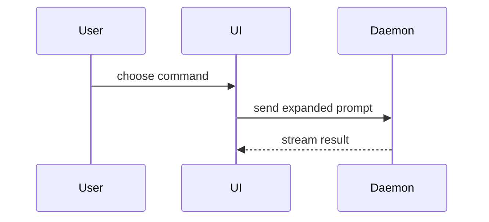

Your task:

$ARGUMENTS

---

Help me understand the current topic visually. Skip the preamble. Keep prose brief. Pick the smallest view that makes the key point clear.

- Show logic or an algorithm as pseudocode:

```text
on(save)
  if content is unchanged
    return cached result
  write new content
  return fresh result
```

- Show runtime control flow as a call tree:

```text
submitForm
  createSession
    persistPrompt
    launchAgent
  navigateToSession
```

- Show UI structure as a component tree. Include state and module boundaries that matter:

```tsx
<SessionPage> (apps/example/src/routes/session.tsx)
  useSessionEvents()
  <SessionToolbar>
    <RunSkillButton> (packages/ui)
```

- Show file responsibility or a broad refactor as a shallow file tree:

```text
src/
├── commands/       # parses user actions
├── sessions/       # owns session state
└── transport/      # sends API requests
```

- Show component interaction, control flow, or data flow with Mermaid:



- Use `diff` when the point is what changes and the surrounding shape already exists. Match the diff shape to the topic.

For a component change:

```diff
 <SessionPage>
   useSessionEvents()
   <SessionToolbar>
+    <RunSkillButton />
   <SessionTimeline>
+    <SkillResultCard />
```

For a file-layout change:

```diff
 src/
 ├── commands/
+│   └── show-me.ts       # expands the slash command
 ├── sessions/
-└── transport.ts
+└── transport/
+    ├── client.ts
+    └── stream.ts
```

For a call-tree or call-stack change:

```diff
 submitForm
   createSession
     persistPrompt
+    expandSkillMention
     launchAgent
-  navigateToSession
+  navigateToSession
+    subscribeToEvents
```

For a state or control-flow change:

```diff
 on(save)
-  write content
+  if content is unchanged
+    return cached result
+  write new content
+  invalidate cache
```

- Show the whole block when one of these is true:

  - Most of it is new.
  - Omitted context hides ownership or order.
  - The user needs a copyable target shape.

```ts
function expandSkill(command: string): string {
  const skillName = command.slice(1)
  return `use the ${skillName} skill`
}
```

- For a visual UI, layout, state comparison, or a concept that is too dense for Mermaid, write one focused HTML file. Use a diagram, an infographic, or a short slide deck. Pick whichever fits the point. Match the product colors, type, spacing, and components. Use real labels and data. Support desktop and mobile. Then open it for the user:

```
Bash(open path/to/show-me-{description}.html)
```

### guidance

Place each visual next to the short text that it supports. Keep only the calls, files, props, states, and boundaries that answer the current question or resolve the discussion point.

Use one or several of these views. Use your judgement. Do not overwhelm the user.
